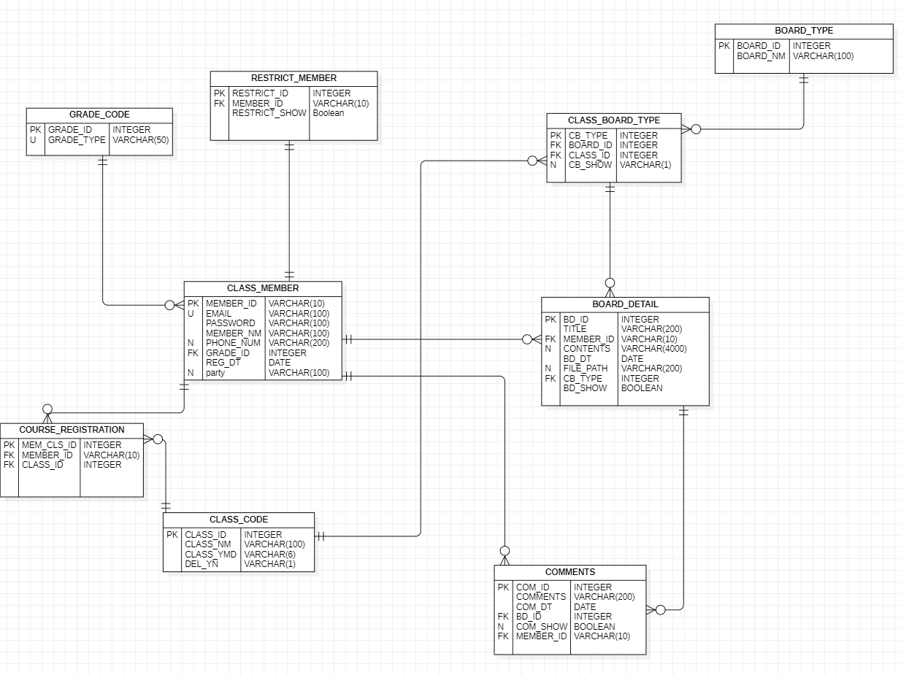

# 개인 프로젝트

## 소개

수업 관리 게시판입니다.

어드민 게시판을 통해서 회원 관리, 수업 관리, 게시판 관리를 수행할 수 있습니다.

회원은 게시판 글쓰기 , 게시판 댓글 달기 , 파일 다운로드 업로드가 가능합니다.

## 향후 목표
aws 에 배포를 목표로 합니다.

### 기술 스택

- java 11
- spring boot 2.7.10
- mysql 8.0.34 (로컬)
- mysql 5.3.74 (aws light sale)

## ERD

## admin 구현 기본 사진

### admin 학생관리

### admin 게시판 관리

