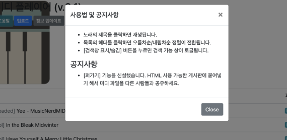
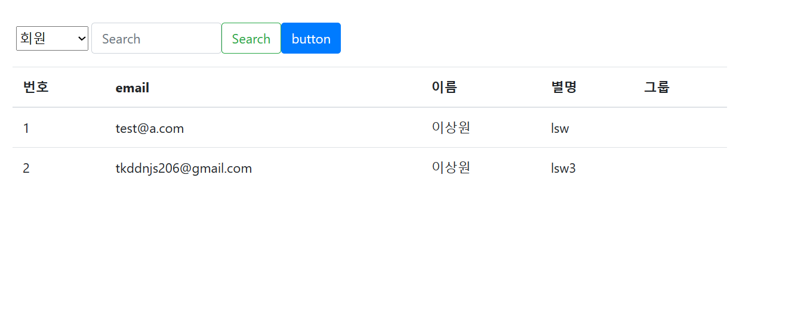
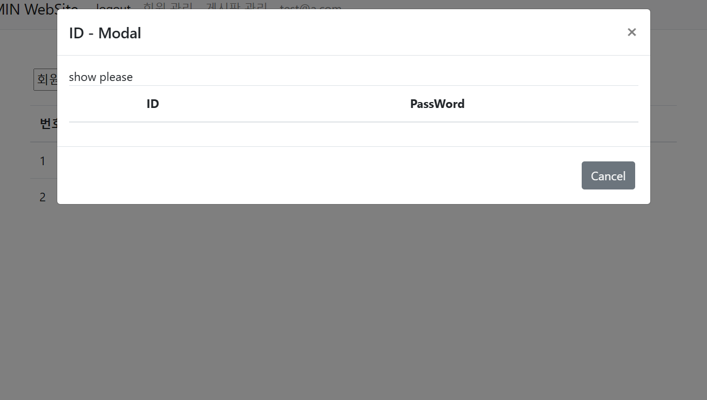

컨셉

교수님 수업 보조 게시판

04/23 개발일지

타임리프 템플릿 -> 상대경로
https://jddng.tistory.com/235

redirect를 하면서 파라미터 넘겨주기
https://mine-it-record.tistory.com/416

04/24

interceptor 폼 만들어 놓음

navbar를 구현하기 위한 페이지
https://getbootstrap.kr/docs/5.0/components/navbar/

04/26

html에서 

이러한 것을 modal 창이라고 한다.

관련
https://getbootstrap.com/docs/4.0/components/modal/

paging 과 관련된 글 유용할 것 같음
https://congsong.tistory.com/26

04/27
다음 버튼 문제 해결 필요

meber를 dao에서 리턴하는 게 아니라 memberdto를 따로 만들 것

04/29
modal 참고한 블로그
https://badstorage.tistory.com/18

4/30

게시판 관련 유용한 블로그
https://developeryoung.tistory.com/category/%EC%9D%B8%ED%84%B4%20%EA%B8%B0%EB%A1%9D/%EA%B2%8C%EC%8B%9C%ED%8C%90%3F%EB%B8%94%EB%A1%9C%EA%B7%B8%3F%EB%A7%8C%EB%93%A4%EA%B8%B0?page=1

페이징 처리에 대한 혜안을 준 블로그
https://congsong.tistory.com/26

javascript 단에서 타임리프가 안먹음 이유 한번 찾아봐야 함!

5/06 

javascript ajax 뻘짓...
https://okky.kr/questions/586547

https://webisfree.com/2021-01-25/%EC%9E%90%EB%B0%94%EC%8A%A4%ED%81%AC%EB%A6%BD%ED%8A%B8%EC%97%90%EC%84%9C-%EC%BF%BC%EB%A6%AC%EC%8A%A4%ED%8A%B8%EB%A7%81%EC%9D%84-%EA%B0%9D%EC%B2%B4-object%EB%A1%9C-%EB%B3%80%ED%99%98%ED%95%98%EA%B8%B0

5/07
rest 테스트 준비

05/08

스키마 단 수정

05/09
스키마 수정(좀 더 기능을 간단하게 CRUD에 포컼싱) 및 참고 자료
https://m.blog.naver.com/PostView.naver?blogId=imhjp&logNo=220799764253&targetKeyword=&targetRecommendationCode=1

페이지 내부 스크롤 만들기
https://ooz.co.kr/88

05//27

BRD 수정 및 체크 <- update 쿼리 및 그 restrict show

05/28
js 특수문자 인코딩시 깨짐 해결법
https://m.blog.naver.com/PostView.naver?isHttpsRedirect=true&blogId=feminists&logNo=220874234976

06/04 

java cms 참고 자료
http://jpcms.co.kr/

mybatis paging

https://oingdaddy.tistory.com/329

mybatis 와일드 카드 사용 참고

https://dongram.tistory.com/12