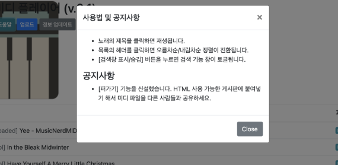
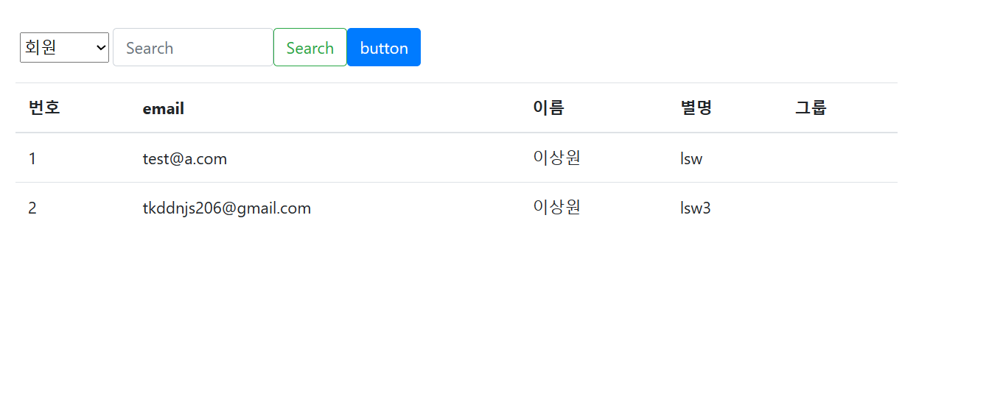

04/23 개발일지

타임리프 템플릿 -> 상대경로
https://jddng.tistory.com/235

redirect를 하면서 파라미터 넘겨주기
https://mine-it-record.tistory.com/416

04/24

interceptor 폼 만들어 놓음

navbar를 구현하기 위한 페이지
https://getbootstrap.kr/docs/5.0/components/navbar/

04/26

html에서 

이러한 것을 modal 창이라고 한다.

관련
https://getbootstrap.com/docs/4.0/components/modal/

paging 과 관련된 글 유용할 것 같음
https://congsong.tistory.com/26

04/27
다음 버튼 문제 해결 필요

meber를 dao에서 리턴하는 게 아니라 memberdto를 따로 만들 것